# PM Vibe Code Operations

[](https://creativecommons.org/licenses/by/4.0/)


> **Empower Product Managers to orchestrate AI coding agents for production-ready applications—no deep technical expertise required.**

## TL;DR

Write a PRD → Run 10 commands → Get production-ready code with tests, docs, and security review.

```bash
# Project-level (once per project)
/generate_service_inventory    # Catalog existing code
/discovery                     # Analyze patterns
/epic-planning                 # Create business epics
/planning                      # Break into tickets

# Ticket-level (for each ticket)
/adaptation                    # Create implementation guide
/implementation                # AI writes code
/testing                       # Build & run tests
/documentation                 # Generate docs
/codereview                    # Quality check
/security_review               # Final gate → closes ticket
```

**Time**: 6-9 hours per feature (vs. 2-4 weeks traditional)
**Quality**: 90%+ test coverage, automated security review, full documentation

---

## Choose Your Workflow Mode

This repository offers two workflow modes. **Start with Simple Mode** unless you have specific needs for concurrent development.

| Mode | Location | Best For |
|------|----------|----------|
| **Simple Mode** | `claude/commands/` | Most users, one ticket at a time |
| **Worktree Mode** | `claude/commands-worktrees/` | Advanced users, concurrent development |

### Simple Mode (Recommended)
Standard git branches. Work on one ticket at a time. Straightforward and reliable.
- Use commands from `claude/commands/`
- [Simple Mode README](claude/commands/README.md)

### Worktree Mode
Git worktrees for complete isolation. Work on multiple tickets simultaneously.
- Use commands from `claude/commands-worktrees/`
- [Worktree Mode README](claude/commands-worktrees/README.md)
- [Worktree Guide](docs/WORKTREE_GUIDE.md)

**Not sure?** Use Simple Mode. You can always switch later.

### New to This?

If you've never used a terminal or command line, start with our [Complete Setup Guide](docs/SETUP_GUIDE.md) which walks you through everything from scratch.

---

## What This Is

A complete, battle-tested workflow that enables Product Managers to leverage AI coding agents (like Claude Code) to build complex, scalable applications while maintaining quality, security, and best practices. This isn't just a collection of prompts, it's a proven methodology for "vibe coding" production applications.

## Who This Is For

✅ **Perfect for:**
- Product Managers leading technical teams who want to move faster
- Technical PMs who want to accelerate routine development work
- Solo founders building their MVP with AI
- Engineering leaders standardizing AI-powered workflows

❌ **Not ideal for:**
- Pure research or exploration projects (this is for production code)
- Teams without any technical oversight
- Projects where you can't use AI coding assistants

## Why This Matters

Traditional product development requires deep technical knowledge to translate requirements into working code. This workflow changes that:

- **Write PRDs, Get Production Code**: Transform product requirements into working features through structured AI collaboration
- **Maintain Quality at Scale**: Built-in quality gates ensure code remains maintainable as your application grows
- **Service Reuse Built-In**: Automatic detection of existing functionality prevents code duplication
- **Move Faster on Routine Work**: Move faster on routine development without bottlenecking on engineering availability

## The PM Superpower: Strategic Direction + AI Execution

This workflow separates **what to build** (your strategic vision) from **how to build it** (AI-powered implementation):

- **You provide**: Product requirements, business context, success criteria
- **AI agents handle**: Technical decomposition, implementation, testing, security reviews
- **You maintain**: Final approval, quality oversight, stakeholder communication

### Realistic Expectations

This workflow helps non-technical PMs build software that works in production—with proper tests, documentation, and security review. However, it's important to understand what this is and isn't:

**What you can achieve:**
- Internal tools and utilities that streamline operations
- MVPs and prototypes that can evolve into products
- Standard web applications with common patterns
- Features for existing codebases following established conventions

**What requires additional engineering expertise:**
- Mission-critical systems where failures have serious consequences
- Highly regulated industries (healthcare, finance) requiring compliance review
- Novel architectures or cutting-edge technologies
- Systems requiring deep performance optimization
- Integration with complex legacy systems

**The honest truth:** AI-assisted development with proper quality gates produces reliable software for many use cases. It does not replace the judgment of experienced engineers for complex systems. Use this workflow for appropriate projects, and involve engineering expertise when the stakes demand it.

---

## Technical Overview

A comprehensive suite of AI-powered commands and agents for orchestrating the complete software development lifecycle. This repository provides structured workflows and specialized agents to automate and enhance every phase of development from discovery through deployment.

## Platform Support

This repository includes two implementations:
- **`claude/`** - Claude-specific commands and agent configurations optimized for Claude Code
- **`codex/`** - Platform-agnostic prompts compatible with OpenAI Codex and other AI platforms (agent references removed)

## Workflow Overview

The development workflow consists of sequential phases, each handled by specialized commands that leverage expert agents:

```
Service Inventory → Discovery → Epic Planning → Technical Planning → Adaptation → Implementation → Testing → Documentation → Code Review → Security Review
```

**Project-Level Phases (1-4):** Inventory, Discovery, Epic Planning, Technical Planning
**Ticket-Level Phases (5-10):** Each ticket goes through Adaptation → Implementation → Testing → Documentation → Code Review → Security Review

### Visual Workflow

```mermaid
graph TD
    A[📝 Write PRD] --> B[🔍 Service Inventory]
    B --> C[🔬 Discovery]
    C --> D[🎯 Epic Planning]
    D --> E{Review & Approve Epics}
    E -->|Approved| F[📋 Technical Planning]
    E -->|Revise| A
    F --> G[🎨 Adaptation - Ticket]
    G --> H[🔨 Implementation - Ticket]
    H --> I[🧪 Testing - Build & Fix Tests]
    I --> J[📚 Documentation - Ticket]
    J --> K[👁️ Code Review - Ticket]
    K --> L[🔒 Security Review - Ticket]
    L --> M{Quality Gates Pass?}
    M -->|Yes| N[✅ Commit & Deploy]
    M -->|No| O[🔧 Fix Issues]
    O --> K

    style A fill:#e1f5ff
    style E fill:#fff3cd
    style M fill:#fff3cd
    style N fill:#d4edda
    style O fill:#f8d7da
```



**PM Involvement Points**:
- 📝 **Write PRD** - You define requirements (1-2 hours)
- 🎯 **Epic Planning** - You review and approve epics (20-30 min)
- ✅ **Commit & Deploy** - You approve final deployment (5-10 min)

**AI-Powered Automation**:
- 🔍 Service Inventory - Automated codebase scanning
- 🔬 Discovery - Automated pattern analysis
- 🎨 Adaptation - Creates implementation guide for ticket (reuse analysis, pattern selection)
- 🔨 Implementation - AI writes production code following adaptation guide
- 🧪 Testing - QA agent builds comprehensive test suite, runs and fixes until passing
- 📚 Documentation - Technical writer agent creates API docs, user guides, inline documentation
- 👁️ Code Review - Automated quality checks and pattern compliance
- 🔒 Security Review - Automated OWASP vulnerability scanning and remediation

### Technical Precision Philosophy

Commands balance providing specific technical information with maintaining implementation flexibility:

**✅ Good Technical Context** (Precise but not prescriptive):
- "AuthService (/services/auth) handles 100K daily authentications"
- "Consider leveraging WebSocket infrastructure for real-time needs"
- "OrderDB has 50M records, may need tracking_id column"

**❌ Too Vague** (Not helpful):
- "Use existing authentication"
- "Integrate with order system"

**❌ Too Prescriptive** (Removes autonomy):
- "Must use JWT tokens from AuthService"
- "Must extend OrderController with new endpoint"

## Core Commands

### 🔍 `/generate_service_inventory`
**Purpose**: Creates comprehensive inventory of all existing services, utilities, and infrastructure components to prevent duplication.

**Usage**: `/generate_service_inventory [root-path] [output-file]`

**Key Features**:
- Catalogs all services, utilities, helpers, and components
- Maps middleware, guards, decorators, and interceptors
- Documents event systems and data access patterns
- Creates reuse matrix for future development

---

### 🔬 `/discovery`
**Purpose**: Analyzes codebase structure, patterns, and architectural decisions before implementation.

**Usage**: `/discovery [ticket-id] [codebase-path] [focus-areas]`

**Key Features**:
- Maps directory structure and technology stack
- Identifies design patterns and conventions
- Documents integration points and dependencies
- Creates foundation for adaptation and planning

---

### 🎯 `/epic-planning`
**Purpose**: Transforms PRD and business requirements into capability-focused epics with comprehensive duplicate prevention (works with Linear, Jira, or other MCP-integrated ticketing systems).

**Usage**: `/epic-planning [prd-document] [discovery-report] [business-context] [strategic-focus]`

**Key Features**:
- **Duplicate Prevention**: Multi-layered checks prevent creating duplicate epics
- Pre-flight verification of ALL existing epics before creation
- Similarity scoring and execution plan with user approval
- Creates capability-focused epics (WHAT and WHY, not HOW)
- Quantifies business value for each epic
- Creates project for 4+ epics (Linear project, Jira board, etc.)
- Unique labels ensure idempotency if interrupted

**Duplicate Prevention Workflow**:
1. Queries and documents all existing epics
2. Cross-references each new capability against existing work
3. Creates execution plan (CREATE/SKIP/UPDATE) for user approval
4. Atomic creation with tracking prevents partial states
5. Recovery procedures if duplicates detected

**Ticketing System Integration** (Linear recommended, Jira supported):
- **Project Management**: Appends epic planning summary to project description (preserves existing content)
- **Milestone Creation**: Creates milestones for delivery phases using ticketing system APIs
- **Epic Association**: Links epics to appropriate project milestones with unique labels
- **Business Metrics**: Tracks user outcomes and success metrics in epic descriptions

---

### 📋 `/planning`
**Purpose**: Technical decomposition - breaks epics into actionable sub-tickets with proper dependencies (Linear, Jira, or other ticketing systems).

**Usage**: `/planning <epic-ids> [--prd <prd-file>] [--discovery <discovery-report>] [--context <additional-context>]`

**Examples**:
```bash
# Single epic with no additional context
/planning LIN-123

# Multiple epics with discovery report
/planning LIN-123,LIN-124 --discovery discovery-report.md

# Epic with all context sources
/planning LIN-456 --prd requirements.md --discovery discovery.md --context "Must support 10k concurrent users"

# Process all epics in a project
/planning PROJ-789 --discovery discovery.md
```

**Key Features**:
- **Primary Input**: Epic IDs (comma-separated) or Project ID
- **Optional Context**:
  - `--prd`: Original PRD for detailed requirements
  - `--discovery`: Technical patterns and service inventory
  - `--context`: Ad-hoc constraints or requirements
- **Sub-ticket Creation**: All tickets created as children of parent epics
- **Technical Sizing**: 2-8 hour implementation chunks
- **Dependencies**: Maps blocking relationships between sub-tickets
- **Context Priority**: Epic → User context → Discovery → PRD

---

### 🎨 `/adaptation`
**Purpose**: Creates a comprehensive implementation guide for a specific ticket, analyzing service reuse opportunities and determining the optimal implementation approach.

**Usage**: `/adaptation [ticket-id]`

**Key Features**:
- Analyzes service inventory for reuse opportunities
- Identifies existing patterns and infrastructure to leverage
- Creates adaptation guide specifying which services/components to use
- Maps event-driven patterns where applicable
- Documents anti-duplication requirements
- Provides implementation recommendations for the ticket

---

### 🔨 `/implementation`
**Purpose**: Executes feature development following the adaptation guide with proper Git/PR management.

**Usage**: `/implementation [ticket-id]`

**Key Features**:
- Creates feature branches automatically
- Implements features following adaptation guide recommendations
- Reuses services and patterns identified in adaptation phase
- Updates ticket status in real-time (Linear, Jira, etc.)
- Creates draft PR with proper documentation

---

### 🧪 `/testing`
**Purpose**: Builds comprehensive test suites using the QA engineer agent, then runs and fixes tests until they all pass.

**Usage**: `/testing [ticket-id] [test-scope] [coverage-target] [test-types]`

**Key Features**:
- QA agent builds test suite following existing patterns
- Achieves specified coverage targets (default 90%)
- Implements unit, integration, edge case, and security tests
- Automatically runs tests and fixes failures in a loop
- Commits passing test suite as part of ticket work
- Updates PR with final test results

---

### 📚 `/documentation`
**Purpose**: Creates comprehensive documentation using the technical writer agent after testing is complete. **Does NOT close the ticket—subsequent phases (code review, security review) still follow.**

**Usage**: `/documentation [ticket-id]`

**Key Features**:
- Technical writer agent generates API documentation
- Creates user guides and inline code documentation
- Ensures 100% JSDoc coverage for public APIs
- Generates examples and usage patterns
- Creates README updates if needed
- Commits documentation with the feature code
- **Keeps ticket "In Progress" for subsequent review phases**

---

### 👁️ `/codereview`
**Purpose**: Performs thorough code quality review focusing on patterns, best practices, and maintainability.

**Usage**: `/codereview [ticket-id]`

**Key Features**:
- Analyzes code quality and pattern adherence
- Checks for performance issues and anti-patterns
- Reviews PR comments for addressed concerns
- Adds `code-reviewed` label to PR
- Verifies documentation completeness

---

### 🔒 `/security_review`
**Purpose**: Conducts comprehensive security assessment against OWASP Top 10 and CVE databases. **This is the final gate that closes Linear tickets.**

**Usage**: `/security_review [ticket-id]`

**Key Features**:
- Performs OWASP Top 10 vulnerability assessment
- Checks for latest CVEs in frameworks
- Reviews authentication and authorization
- Implements security fixes when issues found
- **Final quality gate before deployment**
- **Closes Linear ticket as "Done" when no critical/high issues found**
- **Keeps ticket open if critical/high issues need fixing**

## Specialized Agents

### 🏗️ Architect Agent
**Role**: System architecture, discovery, planning, and technical decomposition

**Expertise**:
- Codebase analysis and pattern recognition
- Requirements decomposition into tickets
- Technology evaluation and decision-making
- Architectural consistency enforcement
- Precise technical landscape documentation

**Key Responsibilities**:
- Creates comprehensive service inventories with exact paths and capacities
- Maps existing infrastructure, APIs, and data models precisely
- Breaks down epics into technical tickets while preserving context
- Identifies reuse opportunities with specific service references
- Documents technical constraints and performance baselines

---

### ⚙️ Backend Engineer Agent
**Role**: Server-side implementation with security and scalability focus

**Expertise**:
- REST API and GraphQL development
- Database operations and optimization
- Authentication and authorization systems
- Microservices and event-driven architecture

**Key Responsibilities**:
- Implements secure API endpoints
- Follows repository pattern for data access
- Ensures proper error handling and logging
- Maintains performance standards

---

### 🎨 Frontend Engineer Agent
**Role**: UI implementation following world-class design standards

**Expertise**:
- React/Next.js component development
- Design system implementation
- Accessibility (WCAG 2.2 AA) compliance
- Performance optimization (Core Web Vitals)

**Key Responsibilities**:
- Builds reusable component libraries
- Implements responsive, accessible interfaces
- Ensures design-code parity (±2px tolerance)
- Optimizes for Core Web Vitals targets

---

### 🧪 QA Engineer Agent
**Role**: Comprehensive testing strategy and implementation

**Expertise**:
- Test pyramid implementation (70% unit, 20% integration, 10% E2E)
- Security and penetration testing
- Performance testing and benchmarking
- Accessibility testing automation

**Key Responsibilities**:
- Creates comprehensive test suites
- Identifies edge cases and failure modes
- Implements test data factories
- Ensures 90%+ code coverage

---

### 📝 Technical Writer Agent
**Role**: Creating clear, comprehensive technical documentation

**Expertise**:
- API documentation with examples
- Architecture and system design docs
- User guides and tutorials
- JSDoc and inline documentation

**Key Responsibilities**:
- Documents all public APIs (100% coverage)
- Creates quick start guides
- Maintains README and contribution guides
- Ensures documentation accuracy

---

### 🔐 Security Engineer Agent
**Role**: Security analysis, threat modeling, and vulnerability assessment

**Expertise**:
- OWASP Top 10 assessment
- Penetration testing methodologies
- Secure coding practices
- Compliance (GDPR, HIPAA, SOC2)

**Key Responsibilities**:
- Identifies security vulnerabilities
- Performs threat modeling
- Reviews authentication/authorization
- Ensures compliance requirements

---

### 🎨 Design Reviewer Agent
**Role**: UI/UX review for design system compliance and quality

**Expertise**:
- Design token validation
- Accessibility compliance (WCAG 2.2 AA)
- Responsive design testing
- Performance validation

**Key Responsibilities**:
- Validates design-code parity
- Tests across viewports and browsers
- Ensures accessibility standards
- Reviews micro-interactions and animations

## Git Worktree Integration for Concurrent Development

> **Note**: This section describes **Worktree Mode** in `claude/commands-worktrees/`. If you're using Simple Mode in `claude/commands/`, you can skip this section.

### Overview

The worktree mode uses **git worktrees** to enable true concurrent development with complete isolation between tickets. Each ticket gets its own working directory, eliminating conflicts when multiple AI agents or developers work in parallel.

**Key Benefits:**
- ✅ **Complete Isolation**: Each ticket has dedicated file system - no interference between concurrent work
- ✅ **No Context Switching**: Multiple Claude Code sessions can run simultaneously on different tickets
- ✅ **Clean History**: Changes isolated until merge, producing clean commit graphs
- ✅ **Easy Debugging**: Inspect any ticket's worktree independently without affecting others
- ✅ **Automatic Cleanup**: Worktrees merged and removed after ticket completion

### How It Works

1. **Adaptation Phase** (`/adaptation`):
   - Creates worktree in `.worktrees/[ticket-id]` directory
   - Creates feature branch in the worktree
   - Documents worktree path in Linear ticket for downstream commands

2. **Development Phases** (`/implementation`, `/testing`, `/documentation`, `/codereview`):
   - Auto-load worktree path from Linear ticket
   - Navigate to worktree directory automatically
   - All work happens in isolation
   - Changes committed to worktree's feature branch

3. **Security Review Phase** (`/security_review`):
   - Performs final security assessment
   - **Merges worktree branch to main** when review passes
   - **Removes worktree** automatically after successful merge
   - Closes Linear ticket (final gate)

### Concurrent Development Example

```bash
# Terminal 1: Agent working on authentication (TICKET-101)
claude code
/adaptation TICKET-101
/implementation TICKET-101
# Works in .worktrees/TICKET-101/

# Terminal 2: Agent working on payments (TICKET-102) - NO CONFLICT!
claude code
/adaptation TICKET-102
/implementation TICKET-102
# Works in .worktrees/TICKET-102/

# Both agents work simultaneously without any interference
```

### Worktree Lifecycle

```
Adaptation → Implementation → Testing → Documentation → Code Review → Security Review → Merge & Cleanup
    ↓             ↓             ↓            ↓               ↓               ↓              ↓
  CREATE      Navigate      Navigate     Navigate        Navigate        Navigate    MERGE + REMOVE
 worktree    to worktree   to worktree  to worktree     to worktree     to worktree   worktree
```

### Manual Worktree Inspection

Users can inspect any active worktree:

```bash
# List all active worktrees
git worktree list

# Navigate to specific ticket's worktree
cd .worktrees/TICKET-123

# View worktree status
git status

# Return to main repo
cd ../..
```

### Error Recovery

If a worktree becomes corrupted or needs cleanup:

```bash
# Remove specific worktree
git worktree remove .worktrees/TICKET-123

# Or force removal if needed
git worktree remove --force .worktrees/TICKET-123

# Clean up stale worktree metadata
git worktree prune
```

---

## Workflow Integration

### Ticketing System Integration
All commands integrate with your ticketing system via MCP (Linear recommended, Jira supported):
- **Epic Planning**: Creates projects, epics, and milestones
- **Technical Planning**: Creates sub-tickets under epics
- **Hierarchy**: Maintains proper parent-child relationships
- **Status Management**: Updates across all phases
- **Documentation**: Comments added to tickets at each step
- **Dependencies**: Tracks relationships between tickets

### Git/GitHub Integration
Automated Git workflow management:
- Feature branch creation and management
- Draft PR creation with proper templates
- PR label management (code-reviewed, security-approved, etc.)
- Commit message standardization

### Quality Gates
Each phase adds quality labels to PRs:
- `code-reviewed` - Code review phase complete
- `security-approved` - Security review passed
- `tests-complete` - Testing phase finished
- `docs-complete` - Documentation added

## Best Practices

### Service Reuse
- Always check service inventory before creating new functionality
- Mandate reuse of existing services in tickets
- Prefer event-driven patterns over direct coupling
- Document anti-duplication requirements

### Branch Management
- Never commit to main/master branches
- Use consistent feature branch naming: `feature/[ticket-id]-description`
- Verify branch before any commits
- Keep all phases on same feature branch

### Scope Control
- Each phase handles only its responsibilities
- Implementation doesn't write tests
- Testing doesn't fix unrelated issues
- Security review doesn't fix code quality

### Documentation Standards
- 100% JSDoc coverage for public APIs
- No placeholder content or TODOs
- All code examples must be tested
- Document actual behavior, not intended

## Success Metrics

Commands track and report:
- **Reuse Rate**: Percentage of existing services leveraged
- **Coverage**: Test coverage percentages
- **Security Score**: OWASP compliance rating
- **Performance**: Core Web Vitals metrics
- **Quality**: Code review scores and findings

## Repository Structure

```
pm-vibecode-ops/
├── claude/
│   ├── agents/                  # Specialized AI agent configurations (shared)
│   │   ├── architect_agent.md
│   │   ├── backend_engineer_agent.md
│   │   ├── code_reviewer_agent.md
│   │   ├── design_reviewer_agent.md
│   │   ├── frontend_engineer_agent.md
│   │   ├── qa_engineer_agent.md
│   │   ├── security_engineer_agent.md
│   │   └── technical_writer_agent.md
│   │
│   ├── commands/                # DEFAULT: Simple mode commands
│   │   ├── README.md            # Simple mode documentation
│   │   ├── adaptation.md
│   │   ├── codereview.md
│   │   ├── discovery.md
│   │   ├── documentation.md
│   │   ├── epic-planning.md
│   │   ├── generate_service_inventory.md
│   │   ├── implementation.md
│   │   ├── planning.md
│   │   ├── security_review.md
│   │   └── testing.md
│   │
│   └── commands-worktrees/      # EXPERIMENTAL: Worktree mode commands
│       ├── README.md            # Worktree mode documentation
│       ├── _worktree_helpers.md # Reusable git worktree utilities
│       ├── adaptation.md        # (with worktree logic)
│       └── ... (same commands with worktree integration)
│
├── codex/
│   └── prompts/                 # Platform-agnostic prompts (OpenAI Codex compatible)
│       └── [mirrors claude/commands/ - simple mode only]
│
├── docs/                        # Advanced documentation
│   ├── WORKTREE_GUIDE.md        # Git worktree technical reference
│   └── WORKTREE_MIGRATION.md    # Switching between modes
│
├── PM_GUIDE.md                  # Non-technical guide for Product Managers
├── GET_STARTED.md               # Quick start and navigation
├── QUICK_REFERENCE.md           # One-page cheat sheet
├── EXAMPLES.md                  # Real-world case studies
├── FAQ.md                       # Common questions answered
├── GLOSSARY.md                  # Technical terms explained
├── CHANGELOG.md                 # Version history
├── LICENSE                      # CC BY 4.0
└── README.md                    # This file
```

## Recent Updates

### December 2024
- **Enhanced Duplicate Prevention**: Epic-planning command now includes comprehensive duplicate detection with pre-flight checks, similarity scoring, and user approval workflow
- **Removed Pseudo-Code**: All commands updated to remove non-executable JavaScript/TypeScript examples, replaced with:
  - Executable bash scripts
  - MCP tool invocation instructions
  - Step-by-step process descriptions
  - Clearly marked template examples for implementation reference
- **Improved Command Reliability**: Commands now use only tools they can actually execute via MCP servers

## Getting Started

### Prerequisites
- **Ticketing System** with MCP integration:
  - **Linear** (recommended) - [Get Linear MCP](https://github.com/QuantGeekDev/linear-mcp)
  - **Jira** (supported) - [Get Jira MCP](https://github.com/zcaceres/jira-mcp)
  - Other ticketing systems with MCP integration may work
- Git repository access
- Claude Code CLI with appropriate agents enabled

**Required Integrations**: See [MCP Setup Guide](docs/MCP_SETUP.md) for configuring Linear, Perplexity, and other integrations.

### Enhanced Testing with Browser Automation (Optional)

For UI-heavy applications, browser automation MCP tools significantly enhance the QA agent's capabilities by enabling **visual testing** and **detailed browser debugging**.

#### Supported Browser MCP Tools

**Playwright MCP** (Recommended)
- Multi-browser testing (Chrome, Firefox, Safari, Edge)
- Screenshot and video capture for visual QA
- Network request inspection
- Console log monitoring
- Accessibility testing with built-in audits

**Puppeteer MCP**
- Chrome/Chromium automation
- Performance metrics capture
- Mobile device emulation
- JavaScript coverage reports

**Chrome DevTools MCP**
- Real-time debugging capabilities
- Performance profiling
- Memory leak detection
- Network throttling simulation

#### What Visual QA Enables

With browser automation MCP, the QA agent can:

**Visual Verification**:
- ✅ Capture screenshots of UI states for before/after comparison
- ✅ Verify responsive design across viewports (mobile, tablet, desktop)
- ✅ Detect visual regressions automatically
- ✅ Test animations and transitions

**Interactive Testing**:
- ✅ Simulate real user interactions (clicks, form fills, navigation)
- ✅ Test complex user workflows end-to-end
- ✅ Verify AJAX/dynamic content loading
- ✅ Test error states and edge cases visually

**Cross-Browser Validation**:
- ✅ Test across Chrome, Firefox, Safari, Edge simultaneously
- ✅ Catch browser-specific rendering issues
- ✅ Verify consistent behavior across platforms

**Performance & Debugging**:
- ✅ Capture console errors and warnings
- ✅ Monitor network requests and API calls
- ✅ Measure page load times and Core Web Vitals
- ✅ Identify JavaScript errors in real browser context

#### Setup Example

```bash
# Install Playwright MCP (recommended for most use cases)
npm install -D @playwright/test

# Configure in Claude Code MCP settings
# The QA agent will automatically use Playwright when available
```

#### Integration with Testing Phase

When browser MCP tools are available, the `/testing` command automatically:

1. **Builds traditional test suite** (unit, integration tests)
2. **Adds visual/E2E tests** using browser automation
3. **Runs tests in real browsers** with screenshots
4. **Captures detailed debugging info** (console logs, network activity)
5. **Fixes failures** using visual feedback from browser
6. **Commits comprehensive test suite** including browser tests

#### Example Visual Test Generated

```javascript
test('user can upload and preview profile photo', async ({ page }) => {
  await page.goto('http://localhost:3000/profile');

  // Upload photo
  await page.setInputFiles('input[type="file"]', 'test-photo.jpg');

  // Verify preview appears
  await expect(page.locator('.profile-photo-preview')).toBeVisible();

  // Take screenshot for visual regression
  await page.screenshot({ path: 'profile-photo-preview.png' });

  // Verify no console errors
  const errors = await page.evaluate(() => window.errors || []);
  expect(errors).toHaveLength(0);
});
```

#### When to Use Browser MCP

**Highly Recommended For**:
- Consumer-facing web applications
- Complex UI interactions (drag-drop, multi-step forms)
- Visual-heavy features (dashboards, charts, animations)
- Cross-browser compatibility critical to product

**Optional For**:
- Backend APIs with minimal UI
- Internal tools with simple interfaces
- Mobile-first applications (use mobile-specific testing tools)

**Note**: Browser MCP is optional but dramatically improves test quality for UI-heavy applications. The QA agent adapts its testing strategy based on available tools.

---

### Installation
1. Clone this repository:
   ```bash
   git clone https://github.com/your-org/pm-vibecode-ops.git
   cd pm-vibecode-ops
   ```

2. Configure your ticketing system MCP integration in Claude Code (Linear or Jira recommended)

3. Start using commands in your development workflow:
   ```bash
   # Example workflow

   # PROJECT-LEVEL PHASES (1-4)

   # 1. Inventory existing services
   /generate_service_inventory . inventory.md

   # 2. Discovery - analyze codebase
   /discovery prd.md ProjectName ./src

   # 3. Epic planning - create business epics
   /epic-planning prd.md discovery-report.md market-leader user-value

   # 4. Technical planning - create sub-tickets
   /planning LIN-123,LIN-124 --discovery discovery-report.md --context "High performance"

   # TICKET-LEVEL PHASES (5-10) - Run for each ticket

   # 5. Adaptation - create implementation guide
   /adaptation TICKET-201

   # 6. Implementation - build features
   /implementation TICKET-201

   # 7. Testing - build test suite (QA agent builds, runs, and fixes until passing)
   /testing TICKET-201 unit,integration 90

   # 8. Documentation - create comprehensive docs
   /documentation TICKET-201

   # 9. Code review - quality assurance
   /codereview TICKET-201

   # 10. Security review - vulnerability assessment (final gate, closes ticket)
   /security_review TICKET-201
   ```

## Usage

Each command provides detailed progress updates and integrates seamlessly with your existing ticketing workflow (Linear, Jira, etc.), Git repositories, and CI/CD pipelines. Commands are designed to be run sequentially, with each phase building upon the previous one's outputs.

---

## License

This work is licensed under a [Creative Commons Attribution 4.0 International License](http://creativecommons.org/licenses/by/4.0/).

You are free to share and adapt this material for any purpose, even commercially, as long as you give appropriate credit. See the [LICENSE](LICENSE) file for full details.

### Epic Planning vs Technical Planning

The workflow includes two distinct but connected planning phases:

#### 1. Epic Planning (`/epic-planning`) - Product Management
- **Focus**: User capabilities and business value (WHAT and WHY)
- **Input**: PRD document and business context
- **Output**:
  - Capability-focused epics in your ticketing system
  - Project with milestones (for 4+ epics)
  - Planning summary appended to project description
  - Business metrics and success criteria

#### 2. Technical Planning (`/planning`) - Engineering
- **Focus**: Implementation approach (HOW)
- **Input**:
  - Required: Epic IDs from epic-planning
  - Optional: PRD, discovery report, additional context
- **Output**:
  - Technical sub-tickets (2-8 hours each)
  - Dependencies and critical paths
  - Service reuse recommendations
  - Technical specifications

#### Context Flow
```
PRD → Epic Planning → Epics → Technical Planning → Sub-tickets
         ↓                          ↑        ↑
    Project/Milestones         Discovery  Context
```

This separation ensures product requirements focus on user value while engineering has full autonomy over technical implementation, with optional context enrichment when needed.